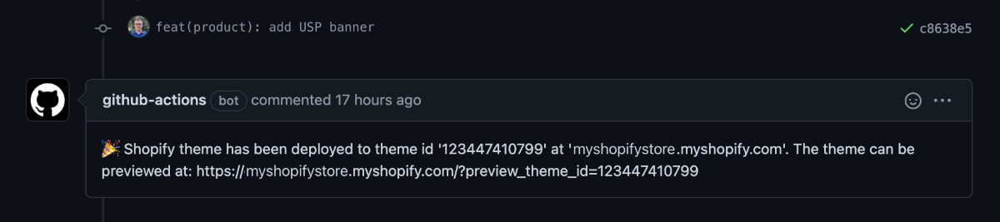

# Shopify Theme Actions

A set of GitHub Actions to enable fast Shopify theme development/review workflows, options:

1. Create & deploy a PR specific preview theme when a PR is opened/updated
2. Remove the PR specific preview theme once the PR is closed
3. Deploy a specified theme when a PR is opened/updated
4. Deploy to a specified Shopify theme once commits are pushed into a branch i.e. deploy to production

#### PR Comments

After any deployment, if `GITHUB_TOKEN` is set & the deployment was triggered by a PR, a comment will be added to the PR with a link to view the Shopify theme preview (as above).

## Get Started

- Create a [Shopify Private App](https://help.shopify.com/en/manual/apps/private-apps#generate-credentials-from-the-shopify-admin) with the permissions `Themes: Read and write`.
- Add the Shopify Private App credentials as the Github secrets; `SHOPIFY_PASSWORD`, `SHOPIFY_API_KEY` and `SHOPIFY_STORE_URL` (i.e. `mystore.myshopify.com`)
- If you do not have the folders already create a `.github` folder with a `workflows` folder inside
- within this `./github/workflows/` folder add any of the below theme development/review workflows; When a:

1. [PR is opened/updated create and deploy a PR specific Shopify theme](./exampleWorkflows/createPullRequestSpecificPreview.yml)

2. [PR is closed remove the previously created PR specific Shopify theme](./exampleWorkflows/removePullRequestSpecificPreview.yml)

3. [PR is opened/updated deploy to a specified theme i.e. testing/staging theme](./exampleWorkflows/deployPullRequstToSpecificTheme.yml)
4. [commmit is pushed to the `main` branch deploy to production](./exampleWorkflows/deployToProduction.yml)

## Requirements

Requires a Shopify Private App to be created with the permissions: `Themes: Read and write`

## Inputs

Github action inputs:

**`ACTION`** _required_

1. `DEPLOYMENT_PREVIEW`  
   Creates a new Shopify theme for each PR raised. If a PR specific theme already exists it will be updated (i.e. on a `git push` after the PR was created).

2. `REMOVE_DEPLOYMENT_PREVIEW_THEME`  
   Removes a previously created PR specific Shopify theme that was created when `ACTION` was set to `DEPLOYMENT_PREVIEW`

3. `DEPLOY`  
   Deploys to the specified Shopify theme, useful for defined `testing`/`staging`/`production` themes. `SHOPIFY_THEME_ID` must be set.  
   _If deploying to the live Shopify stores theme make sure to set `SHOPIFY_ALLOW_LIVE_THEME_DEPLOYMENT` to `true`_

**`SHOPIFY_STORE_URL`** _required_  
The shopify development store i.e. my-store.myshopify.com  
_Should be stored as a GitHub secret!_

**`SHOPIFY_PASSWORD`** _required_  
The Shopify store's private app password used with themekit  
_Should be stored as a GitHub secret!_

**`SHOPIFY_API_KEY`** _required_  
The Shopify store's private app API Key to allow theme creation and removal  
_Should be stored as a GitHub secret!_

**`SHOPIFY_THEME_DIRECTORY`** _required_  
The directory containing the Shopify theme to deploy i.e. `./dist`

**`SHOPIFY_THEME_ID`** _optional_  
The Shopify theme that will be deployed to (only used if 'ACTION' is 'DEPLOY')

**`SHOPIFY_ALLOW_LIVE_THEME_DEPLOYMENT`** _optional_  
If deploying to a 'live' (published) Shopify theme this must be set to `true`

**`GITHUB_TOKEN`** _optional_  
Github authentication token that allows comments to be created on PRs.  
_If not set comments cannot be created on PRs and previously created PR specific Shopify themes cannot be removed._

## Outputs

Github action outputs (can be used in following steps):

**`SHOPIFY_THEME_ID`**  
The newly created/found/supplied Shopify theme id

**`SHOPIFY_THEME_PREVIEW_URL`**  
The URL the theme can be previewed at

## License

Shopify Theme Actions is [MIT licensed](./LICENSE).
